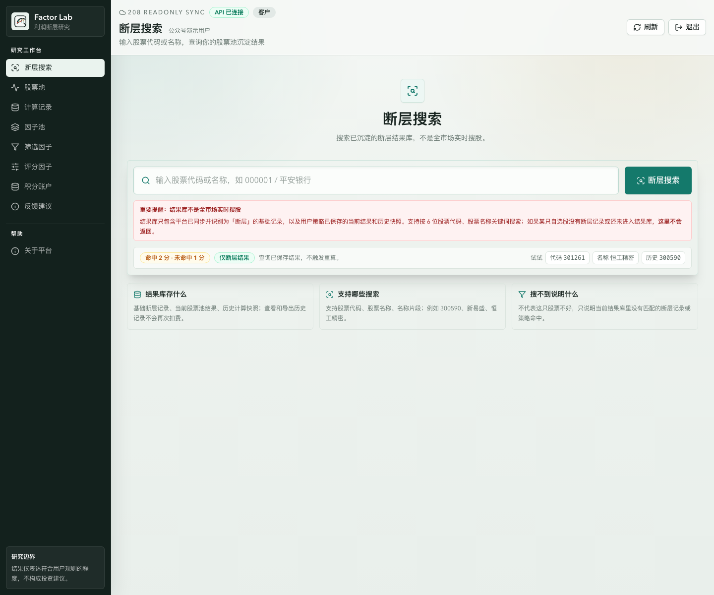
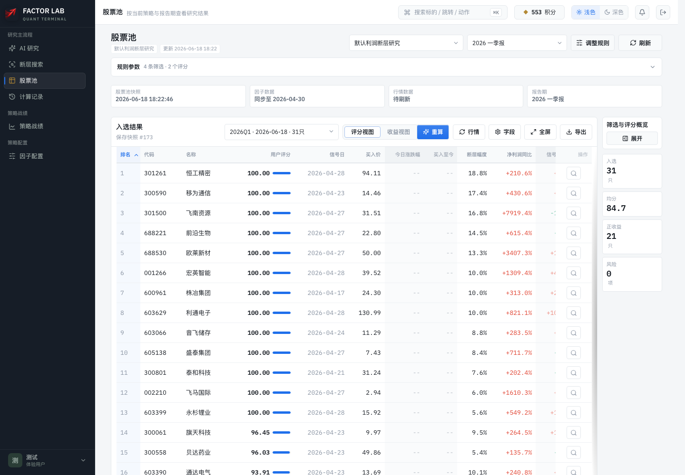
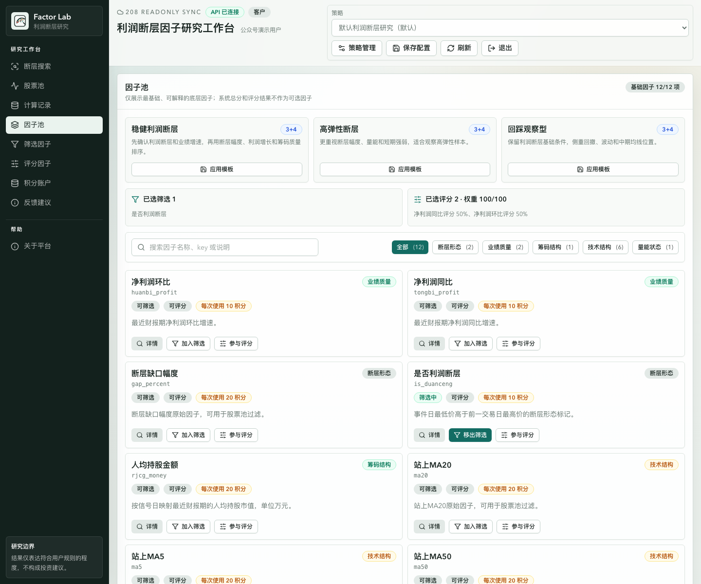
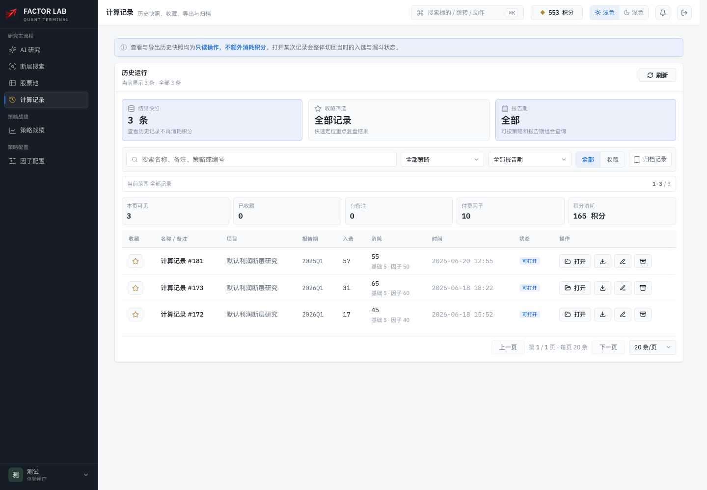
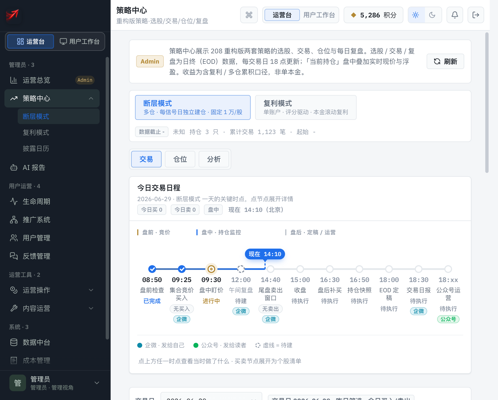
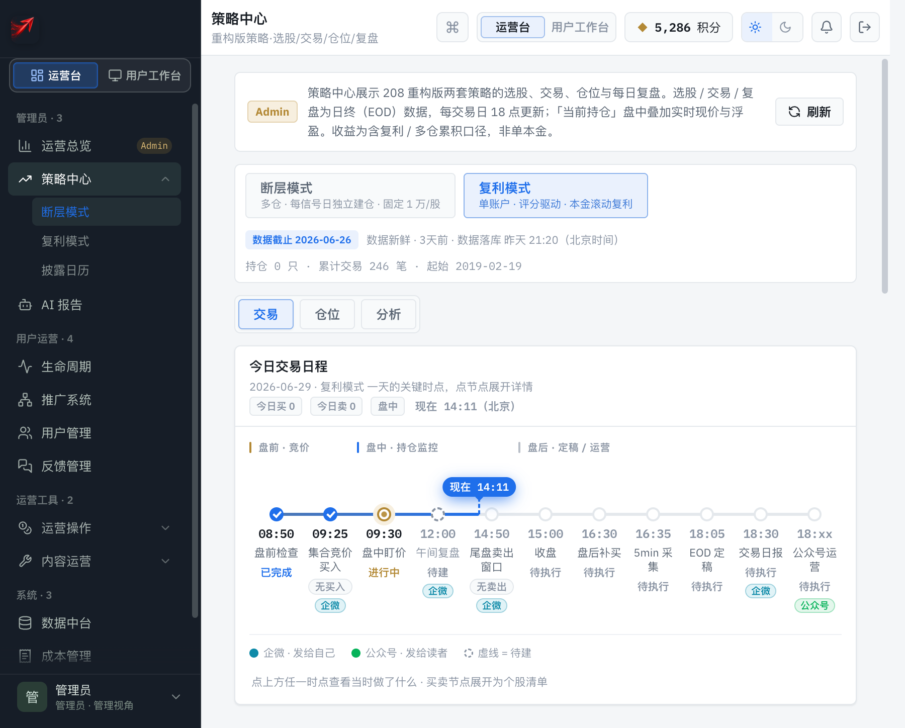
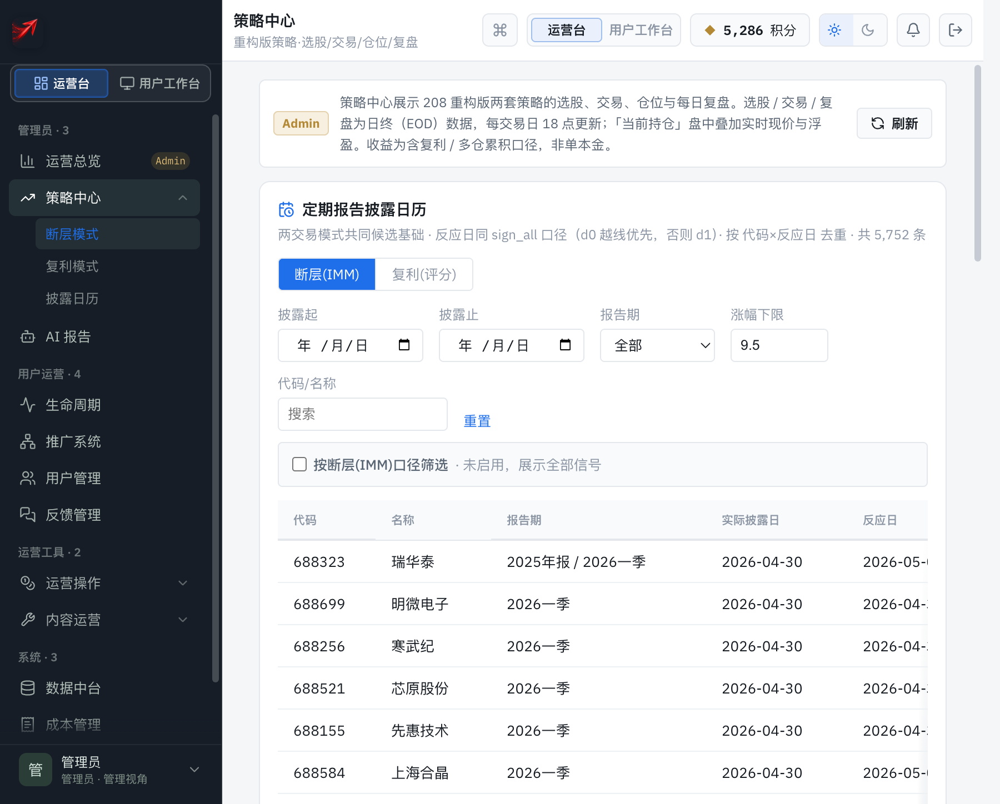
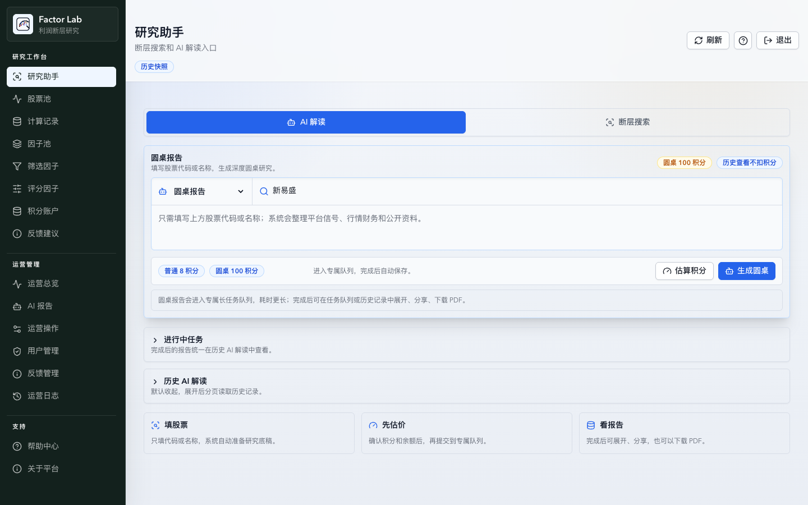
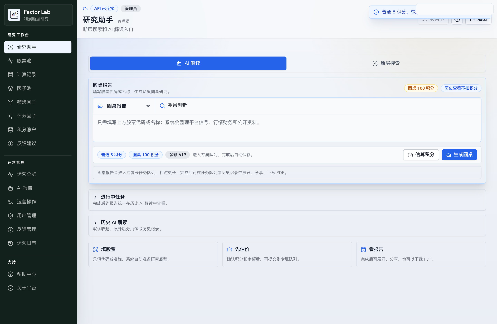
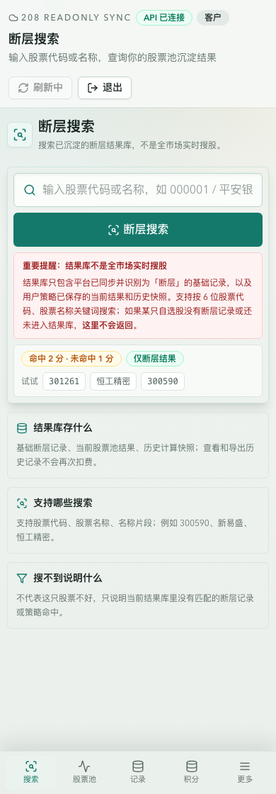

# Factor Lab

Factor Lab 是一个面向 A 股利润断层研究的因子工作台。

它用于搜索利润断层记录、配置筛选和评分因子、生成股票池、追踪策略交易历史，并通过 AI 解读、圆桌报告和报告广场辅助研究者复盘自己的判断过程。

体验地址：https://www.afactorlab.com/

> Factor Lab 仅用于投研辅助、学习交流和研究复盘，不构成投资建议，也不承诺任何收益。

## 现在可以体验

- **断层搜索**：输入股票代码或名称，查看该股票是否进入过平台识别到的利润断层结果库。
- **股票池计算**：选择真实财报报告期，基于筛选因子和评分因子生成股票池。
- **因子配置**：把基础因子加入筛选条件或评分模型，形成自己的研究规则。
- **历史记录**：保存每次计算的报告期、筛选条件、评分权重和入选结果，方便后续复盘。
- **行情浮层**：在已有结果上叠加最新价、今日涨跌幅、买入至今涨跌幅等展示信息。
- **策略中心（断层模式）**：查看断层 IMM 策略的完整历史交易记录、胜率和盈亏分布，含今日交易日程与实时持仓监控。数据覆盖 2026 年前全部调仓记录。
- **策略中心（复利模式）**：查看 Focus 复利策略的历史持仓与累计表现，与断层模式并排对比。数据同样覆盖 2026 年前全部持仓历史。
- **披露日历**：查看 A 股定期报告披露计划，了解各报告期实际披露时间与断层信号生成节奏。
- **AI 解读**：围绕股票、股票池和研究结果生成辅助解读，支持普通解读和快速解读。
- **圆桌报告**：围绕一只股票生成多角色研究讨论，支持基本面圆桌和短线圆桌两个赛道。
- **短线圆桌**：聚焦最近有效交易日附近的量价状态，把近期强度和最新交易日状态分开看。
- **报告广场**：浏览平台公开的精选报告，适合先看样例，再发起自己的研究。
- **手机端体验**：主要页面、长列表、报告正文和操作弹窗已适配手机浏览器。
- **反馈建议**：在平台内提交问题、建议、数据疑问和体验反馈。

## 适合谁

Factor Lab 更适合这些使用场景：

- 关注财报、利润断层、业绩预告、财报超预期等事件。
- 希望把自己的股票池筛选逻辑从 Excel 或临时脚本中沉淀下来。
- 想比较不同因子组合下的候选结果。
- 需要回看某次计算当时使用了哪些报告期、筛选条件和评分权重。
- 希望把 AI 报告当作研究材料整理工具，而不是直接交易信号。
- 愿意把平台当作研究工作台，而不是买卖信号工具。

它不适合这些需求：

- 寻找“明天必涨”的股票。
- 直接根据平台结果买卖。
- 期待系统给出目标价、止盈止损或收益承诺。
- 只想看结论，不关心因子逻辑和复盘过程。

## 策略历史表现

以下数据来自策略中心历史回放，均为已平仓交易的真实记录（2019–2026）。不含手续费，不构成投资建议。

### 断层模式（IMM）

每个利润断层信号日独立建仓，固定 1 万/股，信号触发后次日买入。

| 指标 | 数值 |
|------|------|
| 已平仓笔数 | 1,123 笔 |
| 数据区间 | 2019-03-11 → 2026-06-24 |
| 平均每笔收益 | +6.44% |
| 胜率 | 50.8% |
| 盈亏比 | 2.83 |
| 平均持仓 | 33.4 天 |

**[→ 完整调仓流水（1,023 笔，2026年前）](data/imm-trades.csv)**（CSV，含买卖价、收益、持仓天数）

### 复利模式（Focus）

单账户评分驱动，本金滚动复利，10 万起始资金。

| 指标 | 数值 |
|------|------|
| 已平仓笔数 | 246 笔 |
| 数据区间 | 2019-03-11 → 2026-06-15 |
| 平均每笔收益 | +2.75% |
| 胜率 | 65.0% |
| 盈亏比 | 1.38 |
| 平均持仓 | 4.4 天 |

**[→ 完整调仓流水（225 笔，2026年前）](data/focus-trades.csv)**（CSV，含评级、买卖价、收益、持仓天数）

> 以上为 2026 年前的历史数据快照。如需获取最完整的数据、2026 年后持续更新的调仓记录，以及实时持仓和今日交易日程，请访问平台：**https://www.afactorlab.com/**

## 产品截图

### 股票池

### 因子池

### 计算记录

### 策略中心（断层模式）

### 策略中心（复利模式）

### 披露日历

### 圆桌报告

### 移动端搜索

## 快速开始

1. 打开 https://www.afactorlab.com/
2. 注册并登录。
3. 从”研究助手”开始，输入股票代码或名称。
4. 进入股票池，选择报告期，查看或重算结果。
5. 在 AI 解读中选择普通解读、快速解读、圆桌报告或短线圆桌。
6. 在因子池、筛选因子、评分因子中调整自己的研究规则。
7. 在计算记录中回看历史结果，必要时导出保存。
8. 进入策略中心，查看断层模式和复利模式的历史交易记录与今日交易日程。

更详细的入口说明见：[快速开始](docs/quickstart.md)。

## 文档

- [快速开始](docs/quickstart.md)
- [版本记录](docs/changelog.md)
- [社区发布文案](docs/community-post.md)

## 反馈

如果你在体验中遇到问题，欢迎通过平台内的“反馈建议”入口提交。

反馈时尽量包含：

- 股票代码或名称
- 报告期
- 所在页面
- 操作路径
- 问题截图或你期待的结果

我们尤其希望听到这些反馈：

- 哪些字段看不懂？
- 哪些流程不符合你的研究习惯？
- 哪些地方让你误以为平台在荐股？
- 移动端哪些操作不顺手？
- 哪些因子解释还不够清楚？
- AI 解读和圆桌报告里，哪些表达还不够清楚？

## 边界说明

Factor Lab 是研究辅助工具，不是交易系统。

平台展示的是基于数据、因子和用户配置形成的研究结果。历史表现、评分排序、AI 解读和公开报告都不能代表未来收益，也不应被理解为买入或卖出建议。

请独立判断，谨慎决策。
